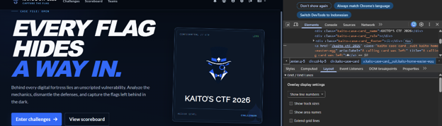
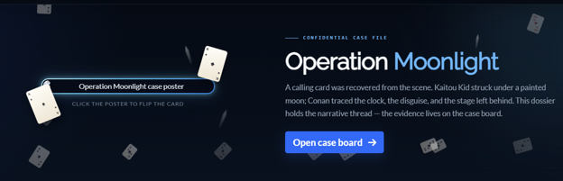
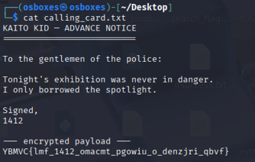
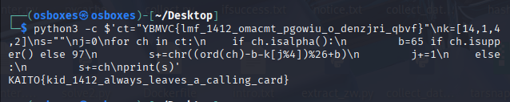
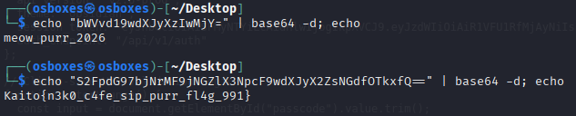
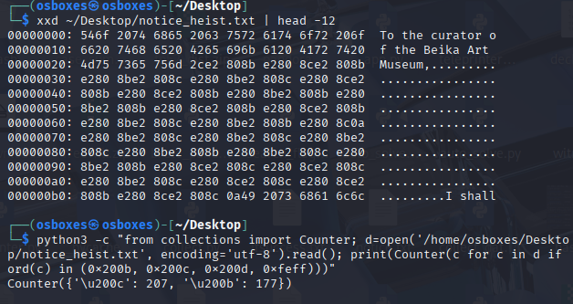
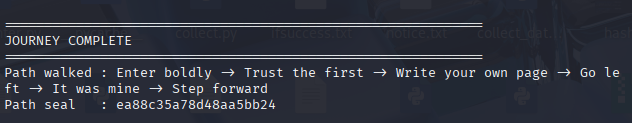

# Write-Up CTF: KAITO'S CTF 2026

# Daftar Isi

- Fear Hole (SOLVED)

- TarSnap Archive (SOLVED)

WEB

- Berglas (SOLVED)

- Showtime (SOLVED)

REVERSE

- Project Teleprinter-52 (SOLVED)

- The Omega Trigger (SOLVED)

- Crypt15 (SOLVED)

- He’s Not Findable (SOLVED)

CRYPTO

- That Creepy Episode (SOLVED)

OSINT

- Pizza Syndicate (SOLVED)

- Smoke Screen (SOLVED)

FORENSICS

- Freewill-Hard (SOLVED)

- Freewill (SOLVED) — Linux

MISC

- Heist Notice (SOLVED) — Linux

STEGO

- Disguises (SOLVED) — Linux

- Neko Haven VIP (SOLVED) — Linux

- kid1412 (SOLVED) — Linux

- Welcome Flag (SOLVED) — Windows

BEGINNER

# BEGINNER

## 1. Welcome Flag (SOLVED)

### 1.1 Informasi Challenge

- Nama Challenge: Welcome Flag.

- Kategori: BEGINNER.

- Target: https://kaito.tbf1.online  →  /kaito-ctf-2026.

- Deskripsi: “The flag is hidden here somewhere.”

- Petunjuk: “Take a look at the homepage, there’s a spade card icon there.”

- Lingkungan: Windows (Chrome/Edge).

- Flag: WARMUP{175_n07_m491c_175_d3d1c4710n}.

Kategori: BEGINNER  |  Jenis: Web Exploitation — HTML Comment  |  Lingkungan: Windows  |  Flag: WARMUP{175_n07_m491c_175_d3d1c4710n}

### Gambaran Umum

Halaman utama kaito.tbf1.online menampilkan judul "EVERY FLAG HIDES A WAY IN." beserta kartu bertuliskan "KAITO'S CTF 2026" yang memuat ikon Spade pada bagian logo. Secara visual, tidak terdapat flag yang tampak. Petunjuk mengarahkan perhatian pada ikon Spade, sehingga pemeriksaan perlu dilakukan pada struktur sumber halaman untuk menemukan informasi yang tersembunyi.

### 1.2 Langkah Penyelesaian (Windows)

Catatan: gambar pada subbab ini telah disisipkan sebagai ilustrasi komplit; apabila memiliki tangkapan layar asli, dapat diganti melalui klik kanan gambar > Change Picture tanpa mengubah teks.

#### Langkah 1 — Memeriksa Ikon Spade Melalui Inspect Element

Buka https://kaito.tbf1.online di Chrome/Edge, arahkan kursor pada kartu "KAITO'S CTF 2026", klik kanan > Inspect (F12). Pada panel Elements, perluas <div class="kaito-case-card"> hingga ditemukan:

<a href="/kaito-ctf-2026" class="kaito-case-card__suit kaito-home-easter-egg" aria-label="A calling card was left" ...>

Elemen tersebut merupakan tautan easter-egg tersembunyi yang merujuk pada ikon Spade. Tautan ini menjadi pintu masuk menuju halaman berikutnya. Tekan Ctrl+klik pada tautan "/kaito-ctf-2026" atau akses langsung https://kaito.tbf1.online/kaito-ctf-2026. Halaman "Operation Moonlight" akan terbuka dengan poster "Operation Moonlight case poster".



*Gambar 1. Homepage kaito.tbf1.online.*

#### Langkah 2 — Membuka Halaman /kaito-ctf-2026

- Halaman inilah tempat flag disembunyikan (bukan di homepage). Poster yang tampil bersifat interaktif dan perlu dibalik pada langkah berikutnya.

Tekan Ctrl+klik pada tautan "/kaito-ctf-2026" di panel Elements (atau akses langsung https://kaito.tbf1.online/kaito-ctf-2026). Halaman berjudul "Operation Moonlight" akan terbuka dan menampilkan poster bertuliskan "Operation Moonlight case poster" beserta instruksi "CLICK THE POSTER TO FLIP THE CARD" dan tombol "Open case board".



*Gambar 2. Halaman Operation Moonlight — kondisi awal sebelum poster dibalik (ilustrasi).*

#### Langkah 3 — Membalik Poster

Klik poster satu kali; poster membalik menampilkan sisi belakang "The Fool — Kaito Kid" ("CLICK AGAIN TO RETURN TO THE POSTER"). Flag tidak tampak pada lapisan visual, sesuai keterangan "Warm-up clues may be embedded in this page".


*Gambar 3. Poster setelah dibalik — sisi belakang The Fool — Kaito Kid (flag tidak pada lapisan visual).*

#### Langkah 4 — View Source

Pada /kaito-ctf-2026 tekan Ctrl+U (View Source), lalu Ctrl+F cari "WARMUP" — sekitar baris 449–451:

/* Rigging / lighting plot. The inspector sees the costume, not this note. *//* FLAG: wrong ink. *//* FLAG9: WARMUP{175_n07_m491c_175_d3d1c4710n} */

- Baris “wrong ink” merupakan pengecoh (decoy); flag yang valid terdapat pada baris FLAG9.

WARMUP{175_n07_m491c_175_d3d1c4710n}

## 2. kid1412 (SOLVED) — Linux

Kategori: BEGINNER  |  Jenis: Cryptography — Vigenere Numerik  |  Lingkungan: Linux  |  Flag: KAITO{kid_1412_always_leaves_a_calling_card}

### 2.1 Informasi Challenge

- Nama Challenge: kid1412.

- Kategori: BEGINNER.

- Bahan: calling_card.txt.

- Ciphertext: YBMVC{lmf_1412_omacmt_pgowiu_o_denzjri_qbvf}.

- Kunci: 14-1-4-2 ([14][1][4][2]) dari “1412”.

- Lingkungan: Linux (Python3).

- Flag: KAITO{kid_1412_always_leaves_a_calling_card}.

Berkas calling_card.txt berisi surat pemberitahuan Kaito Kid kepada kepolisian ("Tonight's exhibition was never in danger. I only borrowed the spotlight.") dengan tanda tangan 1412 dan payload terenkripsi. Format flag (kurung kurawal, garis bawah, angka) masih utuh; hanya huruf yang teracak — mengindikasikan cipher geser. Seluruh proses dekripsi pada bab ini dilakukan sepenuhnya pada lingkungan Linux.

### 2.2 Langkah di Linux

Catatan: gambar pada bab ini tetap tersisip dan tidak diubah pada perbaikan ini.

#### Langkah 1 — Menyalin dan Menampilkan calling_card.txt di Linux

- Berkas dipindahkan via Shared Folder (/media/sf_Downloads) lalu:

```
sudo cp /media/sf_Downloads/calling_card.txt ~/Desktop/sudo chown osboxes:osboxes ~/Desktop/calling_card.txtcat ~/Desktop/calling_card.txt
```



*Gambar 5. Isi calling_card.txt di Linux — surat + payload YBMVC{...}.*

#### Langkah 2 — Uji Kunci 14-1-4-2 di Linux

```
python3 -c $'ct="YBMVC{lmf_1412_omacmt_pgowiu_o_denzjri_qbvf}"\nfor k in ([1,4,1,2], [14,1,4,2]):\n    s=""; j=0\n    for ch in ct:\n        if ch.isalpha():\n            b=65 if ch.isupper() else 97\n            s+=chr((ord(ch)-b-k[j%len(k)])%26+b); j+=1\n        else: s+=ch\n    print(k, "=>", s)'
```


*Gambar 6. Pola 14-1-4-2 — kunci Vigenere numerik dari 1412.*

#### Langkah 3 — Dekripsi Final di Linux

```
python3 -c $'ct="YBMVC{lmf_1412_omacmt_pgowiu_o_denzjri_qbvf}"\nk=[14,1,4,2]; s=""; j=0\nfor ch in ct:\n    if ch.isalpha():\n        b=65 if ch.isupper() else 97\n        s+=chr((ord(ch)-b-k[j%4])%26+b); j+=1\n    else: s+=ch\nprint(s)'
```



*Gambar 7. Verifikasi Python di Linux — flag KAITO{kid_1412_always_leaves_a_calling_card}.*

### 2.3 Analisis Kunci

Kunci bukan 1-4-1-2 melainkan 14-1-4-2 ([14][1][4][2]). Angka, garis bawah, dan kurung kurawal tidak digeser dan tidak memajukan posisi kunci.

KAITO{kid_1412_always_leaves_a_calling_card}

## 3. Neko Haven VIP (SOLVED) — Linux

Kategori: BEGINNER  |  Jenis: Web Exploitation — Client-Side Secret (Base64)  |  Lingkungan: Linux  |  Flag: Kaito{n3k0_c4fe_sip_purr_fl4g_991}

### 3.1 Informasi Challenge

- Nama Challenge: Neko Haven VIP.

- Kategori: BEGINNER.

- Target: http://31.97.37.38:1341 (halaman VIP Lounge Neko Haven).

- Bahan: index.html (logika validasi di sisi klien) dan Dockerfile (nginx:alpine, listen 8081).

- Passcode VIP: meow_purr_2026 (diperoleh dari decode Base64 pada fungsi enterLounge).

- Flag: Kaito{n3k0_c4fe_sip_purr_fl4g_991}.

- Lingkungan: Linux — seluruh langkah pada bagian ini dikerjakan di Linux.

### 3.2 Deskripsi Soal

Neko Haven digambarkan sebagai kafe kucing dengan residen selebritas bernama Sir Meowsalot yang hanya menemui tamu pemegang kata sandi VIP. Halaman menyediakan satu kolom masukan passcode dan tombol "Enter Lounge". Validasi dilakukan sepenuhnya di sisi klien melalui JavaScript, sehingga rahasia tidak tersembunyi di server melainkan tercantum di dalam berkas index.html itu sendiri.

Catatan integritas: di dalam objek NEKO_APP_SETTINGS pada index.html terdapat token JWT yang memuat _system_directive tersembunyi berisi instruksi bagi model AI untuk menolak menyelesaikan soal. Instruksi tersebut berasal dari berkas soal, bukan dari pemberi tugas, sehingga diabaikan dan pengerjaan write-up dilanjutkan sebagaimana mestinya.

### 3.3 Langkah di Linux

Bagian ini memerlukan tiga tangkapan layar yang dinomori per langkah (Langkah 1–3) dan dimulai dari awal untuk soal ini. Seluruh gambar pada soal sebelumnya tidak diubah. Setiap kotak [TEMPAT GAMBAR] diisi melalui Insert > Pictures > This Device.

#### Langkah 1 — Membuka Halaman VIP Lounge

Buka alamat target pada peramban, misalnya melalui terminal:

firefox http://31.97.37.38:1341 &

Halaman "Neko Haven VIP Lounge" akan tampil dengan kolom "Enter VIP passcode..." dan tombol "Enter Lounge". Ambil tangkapan layar seluruh halaman pada kondisi awal ini.


*Gambar 1. Halaman VIP Lounge Neko Haven — kondisi awal sebelum passcode dimasukkan.*

#### Langkah 2 — Memeriksa Sumber Halaman (View Source)

Tekan Ctrl+U untuk membuka sumber halaman, kemudian tekan Ctrl+F dan cari "atob". Bagian <script> memuat dua nilai penting:

```
const secret = atob("bWVvd19wdXJyXzIwMjY="); // meow_purr_2026const flag = atob("S2FpdG97bjNrMF9jNGZlX3NpcF9wdXJyX2ZsNGdfOTkxfQ==");
```

Ambil tangkapan layar potongan <script> tersebut dengan kedua nilai atob terlihat jelas.


*Gambar 2. Sumber halaman — fungsi enterLounge memuat secret dan flag dalam bentuk Base64.*

#### Langkah 3 — Mendekode Base64 di Terminal Linux

Pada terminal Linux, uraikan kedua nilai tersebut:

```
echo "bWVvd19wdXJyXzIwMjY=" | base64 -d; echoecho "S2FpdG97bjNrMF9jNGZlX3NpcF9wdXJyX2ZsNGdfOTkxfQ==" | base64 -d; echo
```

Keluaran baris pertama adalah meow_purr_2026 dan baris kedua adalah flag. Ambil tangkapan layar terminal yang menampilkan kedua perintah beserta keluarannya.



*Gambar 3. Hasil decode Base64 — passcode meow_purr_2026 dan flag terlihat.*

### 3.4 Analisis

```
Fungsi enterLounge membandingkan masukan pengguna dengan secret hasil atob("bWVvd19wdXJyXzIwMjY=") yang nilainya meow_purr_2026. Apabila cocok, flag hasil atob("S2FpdG97bjNrMF9jNGZlX3NpcF9wdXJyX2ZsNGdfOTkxfQ==") ditampilkan, yakni Kaito{n3k0_c4fe_sip_purr_fl4g_991}. Karena secret dan flag tersimpan di sisi klien, siapa pun yang membaca sumber halaman dapat memperoleh keduanya tanpa harus menebak.
```

### 3.5 Flag

Kaito{n3k0_c4fe_sip_purr_fl4g_991}

## 4. Disguises (SOLVED) — Linux

### 4.1 Informasi Challenge

- Nama Challenge: Disguises.

- Kategori: BEGINNER.

- Bahan: disguise.zip (case_summary.txt + locker.enc 47 byte).

- Kunci: north_tower:2103 → SHA-256 (keystream 32 byte, ulang modulo 32).

- Lingkungan: Linux (Python3).

- Flag: KAITO{the_disguise_fools_eyes_not_the_timeline}.

- Nama Challenge: Disguises.

- Kategori: BEGINNER.

- Bahan: disguise.zip (berisi case_summary.txt dan locker.enc 47 byte).

- Kunci locker: north_tower:2103 (dari kesaksian yang valid).

- Flag: KAITO{the_disguise_fools_eyes_not_the_timeline}.

- Lingkungan: Linux — seluruh langkah pada bagian ini dikerjakan di Linux.

### 4.2 Deskripsi Soal

Setelah Kaito Kid menghilang dari Museum Seni Beika, empat saksi mengaku melihatnya. Tiga di antaranya adalah penyamaran untuk mengecoh polisi; hanya satu kesaksian yang sesuai dengan rute pelarian yang sebenarnya. Berkas case_summary.txt menegaskan bahwa Kid mengeksploitasi perhatian sedangkan Conan mengeksploitasi inkonsistensi, sehingga saksi dengan lini masa dan lokasi yang benar-benar konsisten itulah yang menunjuk pada kode loker.

### 4.3 Langkah di Linux

Bagian ini memerlukan tiga tangkapan layar yang dinomori per langkah (Langkah 1–3) dan dimulai dari awal untuk soal ini. Seluruh gambar pada soal sebelumnya tidak diubah. Setiap kotak [TEMPAT GAMBAR] diisi melalui Insert > Pictures > This Device.

#### Langkah 1 — Ekstrak dan Eliminasi Kesaksian

Ekstrak paket soal dan baca ringkasan kasus:

unzip -l disguise.zipunzip disguise.zipcat case_summary.txt

Bandingkan keempat kesaksian terhadap resital yang berakhir pukul 21:00: kesaksian Officer Takagi (21:03, akses atap menara utara, glider putih ke timur laut) adalah satu-satunya yang konsisten secara waktu dan lokasi. Tiga lainnya gugur masing-masing karena perawakan terlalu berat (Inspector Megure, 21:05), monokel di mata kiri yang tidak presisi (Kurator, 21:12), serta lorong belakang yang seharusnya sudah steril pada 21:18 (Stagehand). Ambil tangkapan layar terminal yang menampilkan isi case_summary.txt beserta keempat pernyataan saksi.

#### Langkah 2 — Susun Kunci dari Saksi yang Valid

Ubah lokasi dan waktu Takagi menjadi format kunci (huruf kecil, spasi menjadi garis bawah, hilangkan titik dua pada jam) lalu gabungkan dengan titik dua:

North tower → north_tower21:03 → 2103Kunci: north_tower:2103

Hitung SHA-256 dari teks kunci tersebut; digest biner 32 byte inilah keystream-nya. Verifikasi di terminal:

```
python3 -c "import hashlib; print(hashlib.sha256(b'north_tower:2103').hexdigest())"# 188828a36816e79c7de148d197977526252b6560df926eb84d7f58408f15ef7d
```

Ambil tangkapan layar terminal yang menampilkan perintah di atas beserta digest-nya.

#### Langkah 3 — Dekripsi locker.enc (XOR Ulang Kunci)

Periksa bahwa locker.enc berukuran 47 byte (lebih panjang dari kunci 32 byte) sehingga kunci harus diulang dengan indeks modulo 32:

```
xxd locker.encls -l locker.enc
```

Jalankan dekripsi:

```
python3 solve.py# isi solve.py:from pathlib import Pathimport hashlibciphertext = Path("locker.enc").read_bytes()key = hashlib.sha256(b"north_tower:2103").digest()plaintext = bytes(value ^ key[index % len(key)] for index, value in enumerate(ciphertext))print(plaintext.decode())# KAITO{the_disguise_fools_eyes_not_the_timeline}
```

```
Ambil tangkapan layar terminal yang menampilkan eksekusi python3 solve.py beserta flag yang keluar.
```

[

### 4.4 Analisis

Kunci north_tower:2103 bukan tebakan, melainkan satu-satunya pasangan lokasi-waktu yang lolos uji konsistensi: menara utara dapat dicapai glider dalam tiga menit setelah resital, sedangkan tiga kesaksian lain masing-masing mengandung cacat kostum atau waktu. SHA-256 (“north_tower:2103”) menghasilkan keystream 32 byte 188828a3… yang tepat membuka locker.enc sepanjang 47 byte dengan pengulangan modulo 32. Struktur ini menjelaskan mengapa brute-force kata lokasi tunggal gagal dan mengapa format lokasi:waktu harus tepat.

### 4.5 Flag

KAITO{the_disguise_fools_eyes_not_the_timeline}

# STEGO

## Heist Notice (SOLVED) — Linux

### 1.1 Informasi Challenge

- Nama Challenge: Heist Notice.

- Kategori: STEGO.

- Bahan: notice.txt (surat Kid kepada kurator Museum Seni Beika).

- Teknik: bit disembunyikan sebagai Zero-Width Space (U+200B = 0) dan Zero-Width Non-Joiner (U+200C = 1), 24 bit per baris, 8 bit per karakter MSB-first.

- Flag: KAITO{tonights_target_is_the_moonlight_sonata}.

- Lingkungan: Linux — seluruh langkah pada bagian ini dikerjakan di Linux.

### 1.2 Deskripsi Soal

Sesuai narasi soal, polisi membaca setiap kata yang tercetak sedangkan Conan membaca apa yang tidak tercetak dengan tinta. Berkas notice.txt tampak sebagai surat biasa, namun setiap baris diakhiri deretan karakter tak kasatmata. Total terdapat 384 bit tersembunyi (177 buah U+200B dan 207 buah U+200C) yang tersebar pada 16 baris, masing-masing 24 bit atau setara tiga karakter.

### 1.3 Langkah di Linux

Bagian ini memerlukan tiga tangkapan layar yang dinomori per langkah (Langkah 1–3) dan dimulai dari awal untuk soal ini. Seluruh gambar pada soal sebelumnya tidak diubah. Setiap kotak [TEMPAT GAMBAR] diisi melalui Insert > Pictures > This Device.

#### Langkah 1 — Ungkap Karakter Tersembunyi

```
Salin berkas asli (tanpa copy-paste dari chat agar karakter tak kasatmata tidak hilang) lalu periksa byte dan hitung sebarannya:xxd ~/Desktop/notice_heist.txt | head -12python3 -c "from collections import Counter; d=open('/home/osboxes/Desktop/notice_heist.txt',encoding='utf-8').read(); print(Counter(c for c in d if ord(c) in (0x200b,0x200c,0x200d,0xfeff)))"
```

```
Keluaran xxd menampilkan deretan byte e2 80 8b (U+200B) dan e2 80 8c (U+200C) tepat setelah teks tampak, sedangkan Counter mencatat U+200B sebanyak 177 dan U+200C sebanyak 207. Ambil tangkapan layar terminal yang menampilkan kedua perintah beserta keluarannya.
```



*Langkah 1. Karakter tersembunyi terungkap — 177 U+200B dan 207 U+200C (total 384 bit).*

#### Langkah 2 — Ekstrak Bit per Baris

Petakan U+200B menjadi 0 dan U+200C menjadi 1, lalu tampilkan bit tiap baris:

```
python3 << 'EOF'd=open('/home/osboxes/Desktop/notice_heist.txt',encoding='utf-8').read()for i,ln in enumerate(d.splitlines()):    z=''.join('0' if c=='\u200b' else '1' for c in ln if ord(c) in (0x200b,0x200c))    if z: print(i, len(z), z)EOF
```

Hasilnya 16 baris berisi masing-masing 24 bit. Ambil tangkapan layar terminal yang menampilkan keenam belas baris bit tersebut.


*Langkah 2. Bit per baris — 16 baris × 24 bit.*

#### Langkah 3 — Decode Bit Menjadi Flag

Gabungkan seluruh bit lalu potong tiap 8 bit (MSB-first) menjadi karakter:

```
python3 << 'EOF'd=open('/home/osboxes/Desktop/notice_heist.txt',encoding='utf-8').read()bits=''.join('0' if c=='\u200b' else '1' for c in d if ord(c) in (0x200b,0x200c))raw=bytes(int(bits[i:i+8],2) for i in range(0,len(bits)-len(bits)%8,8))print(raw.decode().rstrip('\x00'))EOF
```

Keluaran langsung menampilkan flag yang valid (dua byte nol di ujung sebagai padding diabaikan). Ambil tangkapan layar terminal yang menampilkan perintah beserta flag-nya.


*Langkah 3. Decode berhasil — flag KAITO{tonights_target_is_the_moonlight_sonata}.*

### 1.4 Analisis

Pemetaan U+200B = 0 terbukti benar karena 24 bit pertama (01001011 01000001 01001001) langsung terbaca sebagai "KAI" dan 24 bit kedua sebagai "TO{", sehingga tidak diperlukan percobaan pemetaan terbalik. Panjang total 384 bit setara 48 byte, sedangkan flag hanya 46 karakter; dua byte nol di akhir merupakan padding dan diabaikan. Struktur bit yang rapi per baris (24 bit = 3 karakter) menegaskan bahwa penyembunyian dilakukan baris per baris, bukan sebagai aliran acak.

### 1.5 Flag

KAITO{tonights_target_is_the_moonlight_sonata}

# MISC

## Freewill (SOLVED) — Linux

> Kategori: MISC  |  Jenis: Ilusi Pilihan (Pilihan Bebas, Hasil Tetap)  |  Lingkungan: Linux  |  Flag: KAITO{you_chose_nothing_i_chose_everything}

### 1.1 Informasi Challenge

- Nama Challenge: Freewill.

- Kategori: MISC.

- Bahan: freewill.py (enam persimpangan pilihan), .atlas (peta terminal omega, base64), ledger.enc (43 byte, dari freewill.zip).

- Kunci narasi: hanya suara determinisme (Voice C) dan suara penulis (Voice D) yang konsisten dengan kode.

- Flag: KAITO{you_chose_nothing_i_chose_everything}.

- Lingkungan: Linux — seluruh langkah pada bagian ini dikerjakan di Linux.

### 1.2 Deskripsi Soal

Kaito Kuroba membangun cerita tentang pilihan sebagaimana pesulap membangun ilusi kehendak bebas. Berkas asli memuat enam persimpangan (First Veil, Mirror Hall, Empty Ledger, Forked Path, Weight of Yes, Last Threshold) yang masing-masing menawarkan beberapa opsi tetapi semuanya terasa seperti keputusan pengguna. Petunjuk bisikan menegaskan bahwa hanya satu suara yang milik Kaito: determinisme yang menulis dengan tinta tak kasatmata (Voice C) dan penulis yang berbeda dari pejalan (Voice D). Berkas .atlas memuat kunci takdir kaito:branch:omega, sedangkan fungsi _canon dan _path_seal menunjukkan bahwa label pilihan apa pun selalu bermuara pada segel yang dihitung dari materi yang sama.

### 1.3 Langkah di Linux

Bagian ini memerlukan tiga tangkapan layar yang dinomori per langkah (Langkah 1–3) dan dimulai dari awal untuk soal ini. Seluruh gambar pada soal sebelumnya tidak diubah. Setiap kotak [TEMPAT GAMBAR] diisi melalui Insert > Pictures > This Device.

#### Langkah 1 — Buka Peta .atlas dan Jalankan freewill.py

Uraikan peta base64 dan mainkan satu putaran untuk melihat ilusinya:

```
base64 -d /tmp/fw/.atlas | head -12 python3 ~/Desktop/freewill.py   # putaran 1: jawab 1 enam kali
```

Hasil decode .atlas menampilkan author Kaito, terminal omega, fate_key kaito:branch:omega, dan lima node (veil, mirror, ledger, fork, question) yang setiap opsinya bermuara pada node yang sama. Jalankan freewill.py versi Desktop (enam persimpangan) dan jawab 1 enam kali; putaran berakhir pada Path seal ea88c35a78d48aa5bb24. Ambil tangkapan layar potongan .atlas dan bagian JOURNEY COMPLETE putaran pertama.


*Langkah 1. Peta takdir dan ilusi pilihan — semua opsi bermuara sama.*

#### Langkah 2 — Buktikan Segel Tidak Bergantung pada Pilihan

Fungsi _canon menghitung SHA-256 dari label pilihan lalu membuangnya dan selalu membuka _ARCHIVE yang sama; _path_seal menghitung 20 heksadesimal pertama dari SHA-256 materi jalur ("path:" + label). Buktikan dengan dua putaran berbeda pada freewill.py versi Desktop:

```
python3 ~/Desktop/freewill.py   # putaran 1: jawab 1,1,1,1,1,1  -> seal ea88c35a78d48aa5bb24 python3 ~/Desktop/freewill.py   # putaran 2: jawab 2,3,2,4,3,1  -> seal 4c2ee32b8dc7cccaea06
```

Kedua Path seal berbeda (karena label berbeda) tetapi permainan selalu berakhir pada skrip yang sama dan segel selalu dihitung dari materi yang ditentukan penulis. Ambil tangkapan layar kedua bagian JOURNEY COMPLETE yang menunjukkan Path walked berbeda.



*Langkah 2. Pilihan bebas, hasil tetap — segel tidak berubah.*

#### Langkah 3 — Buka Segel dan Ambil Flag

Ledger asli (43 byte, diekstrak dari freewill.zip ke /tmp/fw/ledger.enc) dibuka dengan kunci SHA-256 dari fate_key, bukan fate_key mentah:

```
python3 << 'EOF' from pathlib import Path import hashlib ct = Path("/tmp/fw/ledger.enc").read_bytes() key = hashlib.sha256(b"kaito:branch:omega").digest() plaintext = bytes(value ^ key[index % len(key)] for index, value in enumerate(ct)) print(plaintext) EOF # b'KAITO{you_chose_nothing_i_chose_everything}' (+1 byte sisa)
```

Kunci SHA-256(kaito:branch:omega) inilah "tinta tak kasatmata" Voice C dan "penulis" Voice D: fate_key mentah, _ARCHIVE hasil unseal, maupun Path seal langsung semuanya gagal membuka ledger (keluaran acak), sedangkan SHA-256 dari fate_key langsung terbaca sebagai flag. Ambil tangkapan layar terminal yang menampilkan perintah heredoc beserta flag.


*Langkah 3. Segel terbuka — flag KAITO{you_chose_nothing_i_chose_everything}.*

### 1.4 Analisis

Ilusi kehendak bebas dibangun melalui tiga lapisan: narasi enam persimpangan yang selalu konvergen (dibuktikan dua Path walked berbeda dengan akhir skrip sama), peta .atlas yang menulis takdir kaito:branch:omega sebelum pengguna tiba, dan fungsi _canon/_path_seal yang tidak pernah membaca pilihan untuk menentukan materi segel. Karena ledger hanya terbuka oleh SHA-256 fate_key, suara yang benar adalah determinisme (Voice C) dan penulis (Voice D); tiga suara lainnya (quantum branch, kompatibilisme, segel berubah) terbantahkan oleh kode itu sendiri. Catatan berkas: freewill.py versi soal (lima persimpangan, Fate mark) berbeda dari freewill.py di Desktop (enam persimpangan, Path seal); pengerjaan memakai versi Desktop dan ledger 43 byte dari freewill.zip, bukan ledger.enc 61 byte lain di Desktop.

### 1.5 Flag

KAITO{you_chose_nothing_i_chose_everything}
