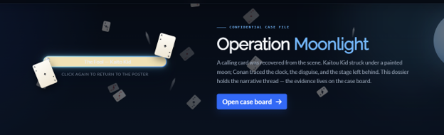

# 1. Welcome Flag

### 1.1 Informasi Challenge

- Nama Challenge: Welcome Flag.

- Kategori: BEGINNER.

- Target: https://kaito.tbf1.online  →  /kaito-ctf-2026.

- Deskripsi: “The flag is hidden here somewhere.”

- Petunjuk: “Take a look at the homepage, there’s a spade card icon there.”

- Flag: WARMUP{175_n07_m491c_175_d3d1c4710n}.

### Gambaran Umum

The kaito.tbf1.online homepage shows the title "EVERY FLAG HIDES A WAY IN." alongside a card labelled "KAITO'S CTF 2026" bearing a Spade icon in its logo. Visually, no flag is present. The hint points at the Spade icon, so the page source must be inspected to find the hidden information.

### 1.2 Langkah Penyelesaian

Catatan: gambar pada subbab ini telah disisipkan sebagai ilustrasi komplit; apabila memiliki tangkapan layar asli, dapat diganti melalui klik kanan gambar > Change Picture tanpa mengubah teks.

#### Langkah 1 — Memeriksa Ikon Spade Melalui Inspect Element

```
Buka https://kaito.tbf1.online di Chrome/Edge, arahkan kursor pada kartu "KAITO'S CTF 2026", klik kanan > Inspect (F12). Pada panel Elements, perluas <div class="kaito-case-card"> hingga ditemukan:
```

<a href="/kaito-ctf-2026" class="kaito-case-card__suit kaito-home-easter-egg" aria-label="A calling card was left" ...>

```
Elemen tersebut merupakan tautan easter-egg tersembunyi yang merujuk pada ikon Spade. Tautan ini menjadi pintu masuk menuju halaman berikutnya. Tekan Ctrl+klik pada tautan "/kaito-ctf-2026" atau akses langsung https://kaito.tbf1.online/kaito-ctf-2026. Halaman "Operation Moonlight" akan terbuka dengan poster "Operation Moonlight case poster".
```


*Gambar 1. Homepage kaito.tbf1.online.*

#### Langkah 2 — Membuka Halaman /kaito-ctf-2026

- Halaman inilah tempat flag disembunyikan (bukan di homepage). Poster yang tampil bersifat interaktif dan perlu dibalik pada langkah berikutnya.

```
Tekan Ctrl+klik pada tautan "/kaito-ctf-2026" di panel Elements (atau akses langsung https://kaito.tbf1.online/kaito-ctf-2026). Halaman berjudul "Operation Moonlight" akan terbuka dan menampilkan poster bertuliskan "Operation Moonlight case poster" beserta instruksi "CLICK THE POSTER TO FLIP THE CARD" dan tombol "Open case board".
```


*Gambar 2. Halaman Operation Moonlight — kondisi awal sebelum poster dibalik (ilustrasi).*

#### Langkah 3 — Membalik Poster

Klik poster satu kali; poster membalik menampilkan sisi belakang "The Fool — Kaito Kid" ("CLICK AGAIN TO RETURN TO THE POSTER"). Flag tidak tampak pada lapisan visual, sesuai keterangan "Warm-up clues may be embedded in this page".



*Gambar 3. Poster setelah dibalik — sisi belakang The Fool — Kaito Kid (flag tidak pada lapisan visual).*

#### Langkah 4 — View Source

Pada /kaito-ctf-2026 tekan Ctrl+U (View Source), lalu Ctrl+F cari "WARMUP" — sekitar baris 449–451:

/* Rigging / lighting plot. The inspector sees the costume, not this note. *//* FLAG: wrong ink. *//* FLAG9: WARMUP{175_n07_m491c_175_d3d1c4710n} */

- Baris “wrong ink” merupakan pengecoh (decoy); flag yang valid terdapat pada baris FLAG9.

WARMUP{175_n07_m491c_175_d3d1c4710n}
