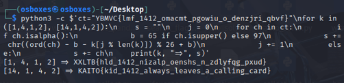

# 2. kid1412

### 2.1 Informasi Challenge

- Nama Challenge: kid1412.

- Kategori: BEGINNER.

- Bahan: calling_card.txt.

- Ciphertext: YBMVC{lmf_1412_omacmt_pgowiu_o_denzjri_qbvf}.

- Kunci: 14-1-4-2 ([14][1][4][2]) dari “1412”.

- Flag: KAITO{kid_1412_always_leaves_a_calling_card}.

The calling_card.txt file contains Kaito Kid's advance notice to the police ("Tonight's exhibition was never in danger. I only borrowed the spotlight.") with the signature 1412 and an encrypted payload. The flag format (braces, underscores, digits) is intact; only letters are scrambled — indicating a shift cipher. The whole decryption in this section is done on Linux.

### 2.2 Langkah-Langkah

Catatan: gambar pada bab ini tetap tersisip dan tidak diubah pada perbaikan ini.

#### Langkah 1 — Menyalin dan Menampilkan calling_card.txt di Linux

- Berkas dipindahkan via Shared Folder (/media/sf_Downloads) lalu:

```
sudo cp /media/sf_Downloads/calling_card.txt ~/Desktop/sudo chown osboxes:osboxes ~/Desktop/calling_card.txtcat ~/Desktop/calling_card.txt
```


*Gambar 5. Isi calling_card.txt di Linux — surat + payload YBMVC{...}.*

#### Langkah 2 — Uji Kunci 14-1-4-2 di Linux

```
python3 -c $'ct="YBMVC{lmf_1412_omacmt_pgowiu_o_denzjri_qbvf}"\nfor k in ([1,4,1,2], [14,1,4,2]):\n    s=""; j=0\n    for ch in ct:\n        if ch.isalpha():\n            b=65 if ch.isupper() else 97\n            s+=chr((ord(ch)-b-k[j%len(k)])%26+b); j+=1\n        else: s+=ch\n    print(k, "=>", s)'
```



*Gambar 6. Pola 14-1-4-2 — kunci Vigenere numerik dari 1412.*

```
python3 -c $'ct="YBMVC{lmf_1412_omacmt_pgowiu_o_denzjri_qbvf}"\nk=[14,1,4,2]; s=""; j=0\nfor ch in ct:\n    if ch.isalpha():\n        b=65 if ch.isupper() else 97\n        s+=chr((ord(ch)-b-k[j%4])%26+b); j+=1\n    else: s+=ch\nprint(s)'
```


*Gambar 7. Verifikasi Python di Linux — flag KAITO{kid_1412_always_leaves_a_calling_card}.*

#### Langkah 3 — Dekripsi Final

Terapkan kunci [14, 1, 4, 2] secara berulang: tiap huruf cipher dikurangi nilai kunci (misal Y−14=K, B−1=A), sedangkan angka, garis bawah, dan kurung kurawal dilewati tanpa memajukan kunci. Skrip decode.py pada Informasi Challenge langsung mencetak flag.

### 2.3 Analisis Kunci

Kunci bukan 1-4-1-2 melainkan 14-1-4-2 ([14][1][4][2]). Angka, garis bawah, dan kurung kurawal tidak digeser dan tidak memajukan posisi kunci.

KAITO{kid_1412_always_leaves_a_calling_card}
