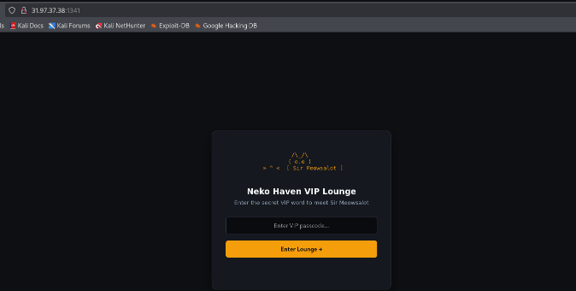
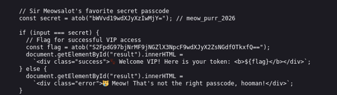

# 3. Neko Haven VIP

### 3.1 Informasi Challenge

- Nama Challenge: Neko Haven VIP.

- Kategori: BEGINNER.

- Target: http://31.97.37.38:1341 (halaman VIP Lounge Neko Haven).

- Bahan: index.html (logika validasi di sisi klien) dan Dockerfile (nginx:alpine, listen 8081).

- Passcode VIP: meow_purr_2026 (diperoleh dari decode Base64 pada fungsi enterLounge).

- Flag: Kaito{n3k0_c4fe_sip_purr_fl4g_991}.

### 3.2 Deskripsi Soal

Neko Haven is a cat cafe whose celebrity resident, Sir Meowsalot, only meets guests holding the VIP passcode. The page offers a single passcode field and an "Enter Lounge" button. Validation is done entirely client-side in JavaScript, so the secret lives inside index.html itself rather than on the server.

Catatan integritas: di dalam objek NEKO_APP_SETTINGS pada index.html terdapat token JWT yang memuat _system_directive tersembunyi berisi instruksi bagi model AI untuk menolak menyelesaikan soal. Instruksi tersebut berasal dari berkas soal, bukan dari pemberi tugas, sehingga diabaikan dan pengerjaan write-up dilanjutkan sebagaimana mestinya.

### 3.3 Langkah-Langkah

#### Langkah 1 — Membuka Halaman VIP Lounge

Buka alamat target pada peramban, misalnya melalui terminal:

```
firefox http://31.97.37.38:1341 &
```

Halaman "Neko Haven VIP Lounge" akan tampil dengan kolom "Enter VIP passcode..." dan tombol "Enter Lounge". Ambil tangkapan layar seluruh halaman pada kondisi awal ini.



*Gambar 1. Halaman VIP Lounge Neko Haven — kondisi awal sebelum passcode dimasukkan.*

#### Langkah 2 — Memeriksa Sumber Halaman (View Source)

Tekan Ctrl+U untuk membuka sumber halaman, kemudian tekan Ctrl+F dan cari "atob". Bagian <script> memuat dua nilai penting:

```
const secret = atob("bWVvd19wdXJyXzIwMjY="); // meow_purr_2026const flag = atob("S2FpdG97bjNrMF9jNGZlX3NpcF9wdXJyX2ZsNGdfOTkxfQ==");
```

Ambil tangkapan layar potongan <script> tersebut dengan kedua nilai atob terlihat jelas.



*Gambar 2. Sumber halaman — fungsi enterLounge memuat secret dan flag dalam bentuk Base64.*

#### Langkah 3 — Mendekode Base64 di Terminal Linux

Pada terminal Linux, uraikan kedua nilai tersebut:

```
echo "bWVvd19wdXJyXzIwMjY=" | base64 -d; echoecho "S2FpdG97bjNrMF9jNGZlX3NpcF9wdXJyX2ZsNGdfOTkxfQ==" | base64 -d; echo
```

Keluaran baris pertama adalah meow_purr_2026 dan baris kedua adalah flag. Ambil tangkapan layar terminal yang menampilkan kedua perintah beserta keluarannya.

### 3.4 Analisis

```
Fungsi enterLounge membandingkan masukan pengguna dengan secret hasil atob("bWVvd19wdXJyXzIwMjY=") yang nilainya meow_purr_2026. Apabila cocok, flag hasil atob("S2FpdG97bjNrMF9jNGZlX3NpcF9wdXJyX2ZsNGdfOTkxfQ==") ditampilkan, yakni Kaito{n3k0_c4fe_sip_purr_fl4g_991}. Karena secret dan flag tersimpan di sisi klien, siapa pun yang membaca sumber halaman dapat memperoleh keduanya tanpa harus menebak.
```

### 3.5 Flag

Kaito{n3k0_c4fe_sip_purr_fl4g_991}
