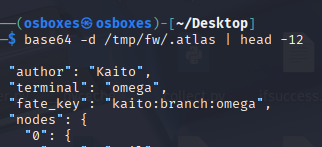
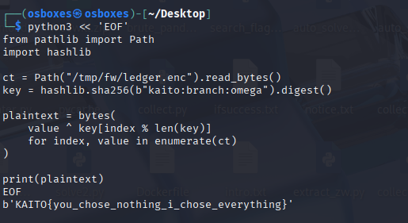

# 1. Freewill

### 1.1 Informasi Challenge

- Nama Challenge: Freewill.

- Kategori: MISC.

- Bahan: freewill.py (enam persimpangan pilihan), .atlas (peta terminal omega, base64), ledger.enc (43 byte, dari freewill.zip).

- Kunci narasi: hanya suara determinisme (Voice C) dan suara penulis (Voice D) yang konsisten dengan kode.

- Flag: KAITO{you_chose_nothing_i_chose_everything}.

### 1.2 Deskripsi Soal

```
Kaito Kuroba builds a story about choice the way a magician builds an illusion of free will. The original files hold six crossroads (First Veil, Mirror Hall, Empty Ledger, Forked Path, Weight of Yes, Last Threshold), each offering options that all feel like the reader's own decision. The whisper hints insist only one voice is Kaito's: determinism writing in invisible ink (Voice C) and the author distinct from the walker (Voice D). The .atlas file carries the fate key kaito:branch:omega, while _canon and _path_seal show that any label choice converges onto author-computed material.
```

### 1.3 Langkah-Langkah

#### Langkah 1 — Buka Peta .atlas dan Jalankan freewill.py

Uraikan peta base64 dan mainkan satu putaran untuk melihat ilusinya:

```
base64 -d /tmp/fw/.atlas | head -12 python3 ~/Desktop/freewill.py   # putaran 1: jawab 1 enam kali
```

```
Hasil decode .atlas menampilkan author Kaito, terminal omega, fate_key kaito:branch:omega, dan lima node (veil, mirror, ledger, fork, question) yang setiap opsinya bermuara pada node yang sama. Jalankan freewill.py versi Desktop (enam persimpangan) dan jawab 1 enam kali; putaran berakhir pada Path seal ea88c35a78d48aa5bb24. Ambil tangkapan layar potongan .atlas dan bagian JOURNEY COMPLETE putaran pertama.
```



```
Fungsi _canon menghitung SHA-256 dari label pilihan lalu membuangnya dan selalu membuka _ARCHIVE yang sama; _path_seal menghitung 20 heksadesimal pertama dari SHA-256 materi jalur ("path:" + label). Buktikan dengan dua putaran berbeda pada freewill.py versi Desktop:
```

```
python3 ~/Desktop/freewill.py   # putaran 1: jawab 1,1,1,1,1,1  -> seal ea88c35a78d48aa5bb24 python3 ~/Desktop/freewill.py   # putaran 2: jawab 2,3,2,4,3,1  -> seal 4c2ee32b8dc7cccaea06
```

Kedua Path seal berbeda (karena label berbeda) tetapi permainan selalu berakhir pada skrip yang sama dan segel selalu dihitung dari materi yang ditentukan penulis. Ambil tangkapan layar kedua bagian JOURNEY COMPLETE yang menunjukkan Path walked berbeda.


```
Ledger asli (43 byte, diekstrak dari freewill.zip ke /tmp/fw/ledger.enc) dibuka dengan kunci SHA-256 dari fate_key, bukan fate_key mentah:
```

```
python3 << 'EOF' from pathlib import Path import hashlib ct = Path("/tmp/fw/ledger.enc").read_bytes() key = hashlib.sha256(b"kaito:branch:omega").digest() plaintext = bytes(value ^ key[index % len(key)] for index, value in enumerate(ct)) print(plaintext) EOF # b'KAITO{you_chose_nothing_i_chose_everything}' (+1 byte sisa)
```

```
Kunci SHA-256(kaito:branch:omega) inilah "tinta tak kasatmata" Voice C dan "penulis" Voice D: fate_key mentah, _ARCHIVE hasil unseal, maupun Path seal langsung semuanya gagal membuka ledger (keluaran acak), sedangkan SHA-256 dari fate_key langsung terbaca sebagai flag. Ambil tangkapan layar terminal yang menampilkan perintah heredoc beserta flag.
```



### 1.4 Analisis

```
Ilusi kehendak bebas dibangun melalui tiga lapisan: narasi enam persimpangan yang selalu konvergen (dibuktikan dua Path walked berbeda dengan akhir skrip sama), peta .atlas yang menulis takdir kaito:branch:omega sebelum pengguna tiba, dan fungsi _canon/_path_seal yang tidak pernah membaca pilihan untuk menentukan materi segel. Karena ledger hanya terbuka oleh SHA-256 fate_key, suara yang benar adalah determinisme (Voice C) dan penulis (Voice D); tiga suara lainnya (quantum branch, kompatibilisme, segel berubah) terbantahkan oleh kode itu sendiri. Catatan berkas: freewill.py versi soal (lima persimpangan, Fate mark) berbeda dari freewill.py di Desktop (enam persimpangan, Path seal); pengerjaan memakai versi Desktop dan ledger 43 byte dari freewill.zip, bukan ledger.enc 61 byte lain di Desktop.
```

### 1.5 Flag

KAITO{you_chose_nothing_i_chose_everything}
