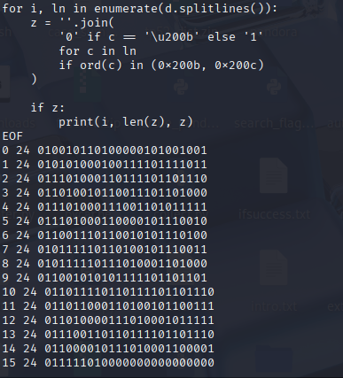
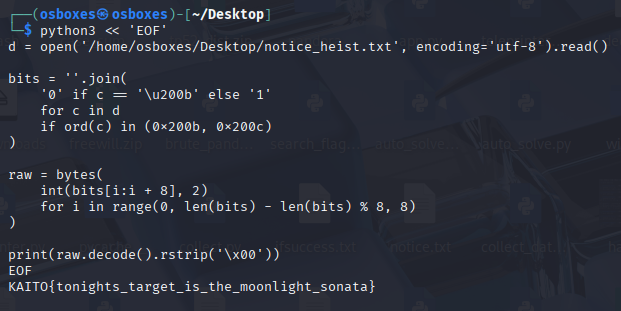

# 1. Heist Notice

### 1.1 Informasi Challenge

- Nama Challenge: Heist Notice.

- Kategori: STEGO.

- Bahan: notice.txt (surat Kid kepada kurator Museum Seni Beika).

- Teknik: bit disembunyikan sebagai Zero-Width Space (U+200B = 0) dan Zero-Width Non-Joiner (U+200C = 1), 24 bit per baris, 8 bit per karakter MSB-first.

- Flag: KAITO{tonights_target_is_the_moonlight_sonata}.

### 1.2 Deskripsi Soal

```
Kaito Kuroba builds a story about choice the way a magician builds an illusion of free will. The original files hold six crossroads (First Veil, Mirror Hall, Empty Ledger, Forked Path, Weight of Yes, Last Threshold), each offering options that all feel like the reader's own decision. The whisper hints insist only one voice is Kaito's: determinism writing in invisible ink (Voice C) and the author distinct from the walker (Voice D). The .atlas file carries the fate key kaito:branch:omega, while _canon and _path_seal show that any label choice converges onto author-computed material.
```

### 1.3 Langkah-Langkah

#### Langkah 1 — Ungkap Karakter Tersembunyi

```
Salin berkas asli (tanpa copy-paste dari chat agar karakter tak kasatmata tidak hilang) lalu periksa byte dan hitung sebarannya:xxd ~/Desktop/notice_heist.txt | head -12python3 -c "from collections import Counter; d=open('/home/osboxes/Desktop/notice_heist.txt',encoding='utf-8').read(); print(Counter(c for c in d if ord(c) in (0x200b,0x200c,0x200d,0xfeff)))"
```

```
Keluaran xxd menampilkan deretan byte e2 80 8b (U+200B) dan e2 80 8c (U+200C) tepat setelah teks tampak, sedangkan Counter mencatat U+200B sebanyak 177 dan U+200C sebanyak 207. Ambil tangkapan layar terminal yang menampilkan kedua perintah beserta keluarannya.
```


#### Langkah 2 — Ekstrak Bit per Baris

Petakan U+200B menjadi 0 dan U+200C menjadi 1, lalu tampilkan bit tiap baris:

```
python3 << 'EOF'd=open('/home/osboxes/Desktop/notice_heist.txt',encoding='utf-8').read()for i,ln in enumerate(d.splitlines()):    z=''.join('0' if c=='\u200b' else '1' for c in ln if ord(c) in (0x200b,0x200c))    if z: print(i, len(z), z)EOF
```

Hasilnya 16 baris berisi masing-masing 24 bit. Ambil tangkapan layar terminal yang menampilkan keenam belas baris bit tersebut.



#### Langkah 3 — Decode Bit Menjadi Flag

Gabungkan seluruh bit lalu potong tiap 8 bit (MSB-first) menjadi karakter:

```
python3 << 'EOF'd=open('/home/osboxes/Desktop/notice_heist.txt',encoding='utf-8').read()bits=''.join('0' if c=='\u200b' else '1' for c in d if ord(c) in (0x200b,0x200c))raw=bytes(int(bits[i:i+8],2) for i in range(0,len(bits)-len(bits)%8,8))print(raw.decode().rstrip('\x00'))EOF
```

Keluaran langsung menampilkan flag yang valid (dua byte nol di ujung sebagai padding diabaikan). Ambil tangkapan layar terminal yang menampilkan perintah beserta flag-nya.



### 1.4 Analisis

Pemetaan U+200B = 0 terbukti benar karena 24 bit pertama (01001011 01000001 01001001) langsung terbaca sebagai "KAI" dan 24 bit kedua sebagai "TO{", sehingga tidak diperlukan percobaan pemetaan terbalik. Panjang total 384 bit setara 48 byte, sedangkan flag hanya 46 karakter; dua byte nol di akhir merupakan padding dan diabaikan. Struktur bit yang rapi per baris (24 bit = 3 karakter) menegaskan bahwa penyembunyian dilakukan baris per baris, bukan sebagai aliran acak.

### 1.5 Flag

KAITO{tonights_target_is_the_moonlight_sonata}
